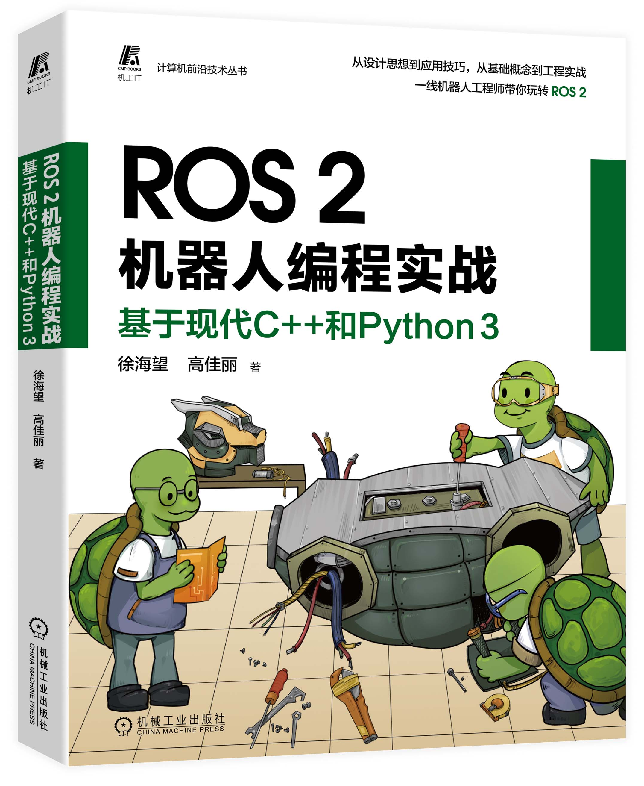

# ros2_for_beginners_code



## 一、简介

本项目囊括了书籍《ROS 2机器人编程实战——基于现代C++和Python 3》的各章节配套代码，意在将书中例程完整呈现，以便帮助读者更好地理解书中内容。

## 二、开发环境配置

为保证能够将项目代码顺利编译、运行、修改及调试，读者需要根据自身当前的软硬件开发环境，对ROS 2进行部署。

由于不同操作系统的软件管理机制不同，ROS 2的开发环境搭建需要根据不同的操作系统（Linux、Windows和macOS）进行相应的配置。

ROS 2相关软件发行分为源码发行与二进制发行两种方式。需要注意的是，源码发行是面向全平台的（Windows，Linux，macOS）且不约束其版本；而二进制发行为了保障适配性，基于不同的操作系统版本，发行了相应的ROS 2的版本，如ROS 2的Foxy发行版首要支持Ubuntu Focal（20.04），macOS Mojave（10.14）和Windows 10。这就要求基于二进制发行版本安装的读者进行版本的对应。

**二进制安装参考说明**：

- https://docs.ros.org/en/humble/Installation/Ubuntu-Install-Debians.html
- https://docs.ros.org/en/humble/Installation/Alternatives/RHEL-Install-Binary.html

以上网址给出的是Ubuntu下Debian的安装说明，及Humble版本的RPM安装说明。读者需要根据自己的操作系统及ROS 2软件版本需求，在 https://docs.ros.org/ 找到合适的安装说明。

**源码安装参考说明**：

- https://docs.ros.org/en/humble/Installation/Ubuntu-Development-Setup.html

此部分可结合书中1.1.3~1.1.4完成.

## 三、示例代码简介

### 1.功能包的构建与测试

本节对应书中2.1.2节的内容，在此项目中目录结构如下图，学习的关键点为以下几点：

- 通过ros2 pkg生成功能包ch2_pkg_cpp以及ch2_pkg_py的过程

- 如何配置并修改package.xml、setup.py及CmakeLists.txt

- 尝试merge以及symlink两种构建指令，比较构建结果的不同，以及构建指令与test指令的关系

```
ros2_for_beginners_code
         |
         |-ch2
            |
            |-package
                 |-ch2_pkg_cpp
                 |-ch2_pkg_py
```

### 2.节点与节点执行器

本节对应书中2.2.1节的内容，在此项目中目录结构如下图，学习的关键点为以下几点：

- 节点的创建方法

- 节点与线程、进程的关系

- 节点执行器的配置，包括线程配置和回调操作配置

- 节点的package.xml及CmakeLists.txt配置

- 节点的简单调试

```
ros2_for_beginners_code
         |
         |-ch2
            |-node
               |-ch2_node_cpp
               |-ch2_node_py
```

### 3. 日志的基本分类

本节对应书中3.1.1节的内容，在此项目中目录结构如下图，学习的关键点为以下几点：

- 日志的分类，rclcpp和rclpy的日志接口设计

- 收集和查阅历史日志的方法

- 日志使用的技巧

```
ros2_for_beginners_code
         |
         |-ch3
            |-logging
               |-ch3_logging_cpp
               |-ch3_logging_py
```

### 4. 使用启动脚本

本节对应书中3.2节的内容，在此项目中目录结构如下图，学习的关键点为以下几点：

- 使用ros2launch启动单个/多个进程

- 使用colcon进行构建并部署

- 使用扩展功能，配置启动脚本的启动信息

```
ros2_for_beginners_code
         |
         |-ch3
            |-launch
               |-ch3_launch
```

### 5. 节点的参数系统

本节对应书中3.3节的内容，在此项目中目录结构如下图，学习的关键点为以下几点：

- 使用ros2param功能包为节点添加参数

- 使用YAML维护参数，提高可维护性

- 动态获取参数的方法

```
ros2_for_beginners_code
         |
         |-ch3
            |-param
               |-ch3_param_bringup
               |-ch3_param_cpp
               |-ch3_param_py
```

### 6. 插件的创建及使用

本节对应书中3.4节的内容，在此项目中目录结构如下图，学习的关键点为以下几点：

- 插件的创建方法

- 使用参数动态加载插件的方法

```
ros2_for_beginners_code
         |
         |-ch3
            |-plugin
               |-ch3_plugin_alpha
               |-ch3_plugin_base
               |-ch3_plugin_beta
               |-ch3_plugin_main
```

### 7. 组件系统的使用

本节对应书中3.5节的内容，在此项目中目录结构如下图，学习的关键点为以下几点：

- 自定义组件的方法

- 使用组件容器加载多个组件

```
ros2_for_beginners_code
         |
         |-ch3
            |-component
                 |-ch3_component
```

### 8. ROS 2通信——topic

本节对应书中4.1节的内容，在此项目中目录结构如下图，学习的关键点为以下几点：

- 理解topic的通信机制，实现发布器与订阅器，思考topic的适用场景

- 运用ros2topic对topic的通信进行调试

- 了解QoS的策略及其兼容性，并正确配置使用

```
ros2_for_beginners_code
         |
         |-ch4
            |-topic
               |-ch4_topic_cpp
               |-ch4_topic_py
```

### 9. ROS 2通信——service

本节对应书中4.2节的内容，在此项目中目录结构如下图，学习的关键点为以下几点：

- 理解基于主从式架构service的通信机制，实现发布器与订阅器，对比topic思考service的适用场景

- 运用ros2service对service的通信进行调试

```
ros2_for_beginners_code
         |
         |-ch4
            |-service
               |-ch4_service_cpp
               |-ch4_service_py
```

### 10. ROS 2通信——action

本节对应书中5.1节的内容，在此项目中目录结构如下图，学习的关键点为以下几点：

- 理解基于主从式架构action的通信机制，实现发布器与订阅器，对比service思考action的适用场景

- 对使用action过程中发生的抢占和队列根据使用场景灵活处理

```
ros2_for_beginners_code
         |
         |-ch5
            |-action
               |-ch5_action_cpp
               |-ch5_action_interfaces
               |-ch5_action_py
```

### 11. ROS 2自定义action消息

本节对应书中5.2节的内容，在此项目中目录结构如下图，学习的关键点为以下几点：

- 使用ros2pkg创建自定义接口功能包的方法

- 使用ros2interface进行接口查看及调试

- 实践中灵活应用ros2/common_interfaces项目中提供的机器人通用功能的接口

```
ros2_for_beginners_code
         |
         |-ch5
            |-interface
               |-ch5_v_interfaces
```

### 12. 基于topic实现坐标系统

本节对应书中5.3节的内容，在此项目中目录结构如下图，学习的关键点为以下几点：

- 使用tf2_ros完成静态坐标变换的广播

- 使用tf2_ros完成动态坐标变换的广播

- 使用tf2_echo，tf2_monitor，buffer_server，static_transform_publisher对tf2进行调试

- 坐标变换监听器的实现

```
ros2_for_beginners_code
         |
         |-ch5
            |-tf2
               |-ch5_tf2_cpp
```

### 13. 使用GDB调试

本节对应书中6.1节的内容，在此项目中目录结构如下图，学习的关键点为以下几点：

- 在项目总添加调试属性的方法

- 使用GDB运行ch6_debug_cpp的可执行程序，进行调试过程的学习

```
ros2_for_beginners_code
         |
         |-ch6
            |-ch6_debug_cpp
```

### 14. 使用rosbag2实现持久记录

本节对应书中6.2节的内容，在此项目中目录结构如下图，学习的关键点为以下几点：

- 使用ros2bag启用压缩/不启用压缩的录制方法

- 使用ros2bag播放和处理bag文件

```
ros2_for_beginners_code
         |
         |-ch6
            |-ch6_bag_cpp
```

### 15. 编写单元测试

本节对应书中6.3节的内容，在此项目中目录结构如下图，学习的关键点为以下几点：

- 使用GooleTest实现单元测试的框架

- 使用lcov统计测试覆盖率

```
ros2_for_beginners_code
         |
         |-ch6
            |-ch6_unittest_cpp
```

### 16. 构建ROS 2的vendor功能包

本节对应书中7.2节的内容，在此项目中目录结构如下图，学习的关键点为以下几点：

- 构建vendor功能包的原因和重要性

- 引入CMake项目的方法

- 引入Autoconf项目的方法

```
ros2_for_beginners_code
         |
         |-ch7
            |-vendor_pkgs
                  |-grpc_vendor
                  |-mpg123_vendor
                  |-opencv_vendor
```

### 17. 使用sensor_msgs接口

本节对应书中7.3节的内容，在此项目中目录结构如下图，学习的关键点为以下几点：

- 熟悉common_interfaces中传感器的消息描述类型

- 多源数据的时间同步策略

```
ros2_for_beginners_code
         |
         |-ch7
            |-sensor
               |-ch7_msgfltr_cpp
               |-ch7_msgfltr_py
```

### 18. 诊断系统

本节对应书中7.4节的内容，在此项目中目录结构如下图，学习的关键点为以下几点：

- 熟悉诊断系统的消息定义及基本组成部分

- 诊断数据的更新器的构建与使用

- 使用更新器功能包DiagnosedPublisher、TopicDiagnostic和HeaderlessTopicDiagnostic帮助检测topic发布频率的异常

- 使用AnalyzerGroup对数据进行收集分析

```
ros2_for_beginners_code
         |
         |-ch7
            |-diagnostics
                  |-ch7_diagnostics_cpp
```

## 四、封面插画


